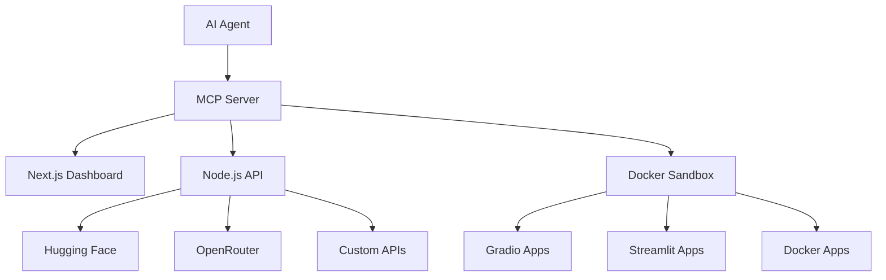

# 🚀 Agentic Hugging Face Spaces OS

> **Autonomous AI agent system for creating, deploying, and managing Hugging Face Spaces with multi-provider inference support**🔥 You’re putting the pieces together exactly right — this is about making your Agentic Hugging Face Spaces OS capable of plug-and-play inference, with BYOK (Bring Your Own Keys) across Hugging Face, OpenRouter, and third-party providers. Exactly 💡 — Hugging Face Spaces are designed to make it super fast to go from idea → working AI app → deployed demo.

Here’s a clear breakdown of how you can get started quickly:

⸻

🚀 Getting Started with Hugging Face Spaces

<LinearProcessFlow steps={[“Choose your framework”, “Create a new Space”, “Push your code”, “Run & test instantly”, “Share with the community”]} />

⸻

1. Choose Your Framework

Spaces support multiple runtimes:
•	Gradio → Perfect for quick ML demos
•	Streamlit → Data dashboards & visualizations
•	Docker → Full custom environments
•	Static HTML/JS → Lightweight demos

⸻

1. Create a New Space
   •	Go to 👉 Hugging Face Spaces
   •	Click “Create new Space”
   •	Pick:
   •	Name
   •	Visibility (Public / Private)
   •	Runtime (Gradio, Streamlit, Docker, etc.)

⸻


1. Run & Test Instantly
   •	Hugging Face auto-builds your environment.
   •	Logs are visible live in the browser.
   •	No DevOps needed — everything is optimized for ML workloads.

⸻

1. Share with the Community
   •	Every Space gets a public URL.
   •	You can:
   •	Embed it in articles/tutorials
   •	Add it to a Collection
   •	Get community feedback via likes & discussions

⸻

✨ That’s it — in a few clicks you can go from idea → hosted AI demo.
Your agent vision can actually automate these steps: create Spaces, push code, deploy models, and publish educational content on its own.

⸻

Do you want me to draft a concrete example (like a Gradio demo app deployed to a Space) so you can see how the full workflow looks?

Let’s lay it out cleanly:

⸻

🔑 API Keys & Inference Provider Autonomy

1. Hugging Face Inference Providers

Config example (MCP-enabled):

{
“servers”: {
“hf-mcp-server”: {
“url”: “https://huggingface.co/mcp”,
“headers”: {
“Authorization”: “Bearer <YOUR_HF_TOKEN>”
}
}
}
}

```
•	If custom key is set → calls go directly to provider API.
•	If not → routed via Hugging Face infra → billed to HF account (with spend limits).
```

⸻

1. Built-in Tools (Agent-Usable)

Your agent can call:
•	🔍 Spaces Semantic Search → Find AI apps
•	📄 Papers Semantic Search → Find ML research
•	🔎 Model Search + Details → With task/library filters
•	🗂️ Dataset Search + Details
•	📘 Docs Search → Explore Hugging Face documentation
•	🖥️ Spaces Tools → Run Spaces as MCP servers

⸻

1. OpenRouter BYOK Integration
   •	Use OpenRouter API keys for non-HF models (Anthropic, Google, OpenAI, etc.).
   •	Provision & manage keys programmatically.
   •	Priority & Fallback Logic:
   •	If your key exists → always used first.
   •	If rate-limited/fails → fallback to shared OpenRouter credits.
   •	Configurable: always_use_this_key = true to disable fallback.

⸻

1. Agent Autonomy with Keys
   •	Autonomous key routing: agent decides which key/provider to use per task.
   •	Examples:
   •	For HF-hosted models → use hf-mcp-server.
   •	For OpenAI GPT-4o or Gemini → route through OpenRouter BYOK.
   •	For internal Sheikh models → register custom MCP endpoint.

⸻

1. Unified Agentic Config

We can build a single config file the agent reads:

providers:
huggingface:
token: ${HF_TOKEN}
mcp_url: https://huggingface.co/mcp
openrouter:
api_key: ${OPENROUTER_KEY}
priority: true
fallback: true
sheikh:
api_key: ${SHEIKH_KEY}
url: https://api.sheikh.codes/v1/chat/completions

⸻

🌐 What This Unlocks
•	Agents can:
✅ Run inference on any HF model/space
✅ Spin up Spaces as MCP microservices
✅ Search & analyze models, datasets, papers, docs
✅ Auto-deploy multimodal apps
✅ Use OpenRouter BYOK for external LLMs
✅ Manage fallback/priority across providers

⸻

⚡ Essentially, this gives your Agent OS a unified brain-to-infra bridge: it can call Hugging Face, OpenRouter, and your own endpoints seamlessly.

⸻

👉 Do you want me to design the agentic-tools.ts (Node/TypeScript MCP adapter) that auto-loads this provider config and exposes all these tools (Spaces search, Model details, Dataset search, etc.) to the agent? We can do use professional stacture maybe with logical prompt engniaring mdx l tags used Exactly 💡 — Hugging Face Spaces are designed to make it super fast to go from idea → working AI app → deployed demo.

Here’s a clear breakdown of how you can get started quickly:

⸻

🚀 Getting Started with Hugging Face Spaces

<LinearProcessFlow steps={[“Choose your framework”, “Create a new Space”, “Push your code”, “Run & test instantly”, “Share with the community”]} />

⸻

1. Choose Your Framework

Spaces support multiple runtimes:
•	Gradio → Perfect for quick ML demos
•	Streamlit → Data dashboards & visualizations
•	Docker → Full custom environments
•	Static HTML/JS → Lightweight demos

⸻

1. Create a New Space
   •	Go to 👉 Hugging Face Spaces
   •	Click “Create new Space”
   •	Pick:
   •	Name
   •	Visibility (Public / Private)
   •	Runtime (Gradio, Streamlit, Docker, etc.)

⸻

1. Push Your Code

Spaces are Git-backed. You can:

git clone https://huggingface.co/spaces/username/my-space
cd my-space

# Add your app files (app.py, requirements.txt, etc.)

git add .
git commit -m “first commit”
git push

⸻

1. Run & Test Instantly
   •	Hugging Face auto-builds your environment.
   •	Logs are visible live in the browser.
   •	No DevOps needed — everything is optimized for ML workloads.

⸻

1. Share with the Community
   •	Every Space gets a public URL.
   •	You can:
   •	Embed it in articles/tutorials
   •	Add it to a Collection
   •	Get community feedback via likes & discussions

⸻

✨ That’s it — in a few clicks you can go from idea → hosted AI demo.
Your agent vision can actually automate these steps: create Spaces, push code, deploy models, and publish educational content on its own. Would you like me to sketch the DSL/system prompt for this “Agentic Spaces OS” (so agents know how to think, plan, build, sandbox, and deploy), or do you want me to jump straight to a repo scaffold (Spaces + Codeserver + Agent controller)? Developer frameworks are advanced coding stacks that can be used to start your next project.like we do FastAPI

FastAPI is a modern, fast (high-performance), web framework for building APIs with Python based on standard Python type hints.

⸻

Do you want me to draft a concrete example (like a Gradio demo app deployed to a Space) so you can see how the full workflow looks?  experimental computer use capabilities to control Firefox. Computer use is a beta feature. Please be aware that computer use poses unique risks that are distinct from standard API features or chat interfaces. These risks are heightened when using computer use to interact with the internet.and Vue.js is a library for building user interfaces in JavaScript. This template uses Vite to serve your app. Grid Layout (Vercel-style)

Vercel’s dashboard and marketing pages usually rely on responsive grids with cards, spacing, and hover effects. build a Vercel-style Grid layout UI (modern, responsive, minimalistic) with shadcn/ui components, and then integrate Redux for state management 🔥 Perfect — you’ve just described the dual core of the system:
1.	Spaces Autonomy Layer → from idea → app → hosted demo → community.
2.	Inference Providers Autonomy Layer → plug-and-play BYOK, routing, fallback, MCP tools.

Let me now stitch this into a professional structured plan with logical prompt engineering (MDX-like tags), so you have something you can feed directly to your AgentOS or turn into a system prompt / design doc.

⸻

⚡ Agentic Hugging Face Spaces OS

<LinearProcessFlow steps={[“Choose Runtime”, “Create Space”, “Push Code”, “Run & Test”, “Share”, “Automate with Keys”]} />

⸻

🚀 Quickstart — Hugging Face Spaces

<section title="Spaces Quickstart">
1. **Choose Your Framework**
   - Gradio → Quick ML demos  
   - Streamlit → Dashboards & visualizations  
   - Docker → Full custom environments  
   - Static HTML/JS → Lightweight demos  

1. **Create New Space**
- Go to [HF Spaces](https://huggingface.co/spaces)
- Click “Create Space”
- Configure → name, visibility, runtime
1. **Push Your Code**
   
   ```bash
   git clone https://huggingface.co/spaces/username/my-space
   cd my-space
   # add app.py + requirements.txt
   git add .
   git commit -m "init demo"
   git push
   
    4.	Run & Test
    •	HF auto-builds env
    •	Live logs
    •	No DevOps
    5.	Share
    •	Public URL
    •	Embed in docs/tutorials
    •	Add to Collections
    •	Collect likes/discussions
   ```

</section>
```

⸻

🔑 Inference Provider Autonomy

<section title="Provider Autonomy">
### Hugging Face MCP Config
```json
{
  "servers": {
    "hf-mcp-server": {
      "url": "https://huggingface.co/mcp",
      "headers": {
        "Authorization": "Bearer <HF_TOKEN>"
      }
    }
  }
}

```
•	Custom key set → direct provider calls
•	No key set → HF infra, billed to account
```

⸻

Built-in Agent Tools
•	🔍 Spaces Semantic Search
•	📄 Papers Semantic Search
•	🔎 Model Search & Details
•	🗂 Dataset Search & Details
•	📘 Docs Search
•	🖥 Run Spaces as MCP microservices

⸻

OpenRouter BYOK
•	Supports Anthropic, Google, OpenAI, etc.
•	Priority & fallback:
•	Prefer BYOK
•	Fallback → shared credits
•	Config: always_use_this_key = true

⸻

Unified Config Example

providers:
huggingface:
token: ${HF_TOKEN}
mcp_url: https://huggingface.co/mcp
openrouter:
api_key: ${OPENROUTER_KEY}
priority: true
fallback: true
sheikh:
api_key: ${SHEIKH_KEY}
url: https://api.sheikh.codes/v1/chat/completions

</section>
```

⸻

🌐 Unlocks

✅ Idea → hosted demo in minutes
✅ Run any HF model / Space as MCP server
✅ Search & analyze datasets, models, papers, docs
✅ Deploy multimodal apps fully autonomously
✅ BYOK → Hugging Face + OpenRouter + custom models
✅ Fallback & routing across providers

⸻

⚡ Autonomy for All → from idea → working software → hosted app → shared portfolio.

⸻Security: never commit secrets to Git. Use environment variables in CI/CD (GitHub Actions secrets / Vercel secrets / HF secrets).

⸻

README snippet / Integration notes
	•	Install dependencies:
	•	npm install js-yaml
	•	Ensure runtime supports fetch (Node 18+). For Node <18, install node-fetch and polyfill.
	•	Usage:
	•	Create agentic-config.yaml (or export AGENTIC_CONFIG env var)
	•	Import AgenticTools and use searchSpaces, searchModels, callModel() etc.
	•	Extensions to implement next (recommended):
	•	Add robust retry, exponential backoff, and status-code based logic
	•	Add streaming support (WebSockets / SSE) for long-running model responses
	•	Add observability (metrics + logs) hooks
	•	Add permission checks / audit logs if agent will manage keys programmatically
	•	Add role-based key provisioning endpoint to rotate keys safely

⸻

Want me to do the next step?
# project="agentic-spaces" file="agentic-config.yaml" type="code"
huggingface:
  token: ${HF_TOKEN} # or put actual token (avoid committing secrets)
  mcp_url: "https://huggingface.co/mcp"

openrouter:
  api_key: ${OPENROUTER_KEY}
  url: "https://api.openrouter.ai/v1/chat/completions"
  priority: true
  fallback: true
  always_use_this_key: false

sheikh:
  api_key: ${SHEIKH_KEY}
  url: "https://api.sheikh.codes/v1/chat/completions"
  priority: false

providers:
  custom_provider_x:
    api_key: ""
    url: "https://custom.provider/api/v1/infer"
    priority: false
    fallback: true
I can:
	•	generate a complete repo scaffold (Node + TypeScript + example HF Space scaffold + GitHub Actions) ready to clone and deploy, or
	•	write a DSL/system-prompt (MDX-style) your AgentOS can consume to orchestrate “idea → plan → build → sandbox → deploy” with concrete instruction templates, or
	•	expand agentic-tools.ts with streaming and sandbox orchestration (codeserver / docker spawn APIs) for the full agentic lifecycle.

Tell me which of the above you want next and I’ll produce the code + CI + example Space ready to 

👉 Next step: do you want me to write the agentic-tools.ts MCP adapter (TypeScript) that auto-loads the provider config and exposes all these HF + OpenRouter tools to your agent runtime? That would give you an actual executable integration layer. Do you write down full plan in MD and make sure logical and independent stacture /fronted /Sandbox /backends

[](https://github.com/your-org/agentic-hf-spaces-os/actions)
[](https://www.typescriptlang.org/)
[](https://opensource.org/licenses/MIT)

## ✨ Overview
# AGENTS.md

A comprehensive guide for AI coding agents working on the Agentic Hugging Face Spaces OS project.

## Project Overview

This is a full-stack TypeScript monorepo that enables AI agents to autonomously create, deploy, and manage Hugging Face Spaces with multi-provider inference support (Hugging Face, OpenRouter, custom endpoints).

**Architecture Components:**

- **Frontend**: Next.js 14 + shadcn/ui dashboard for Space management
- **Backend**: Node.js MCP server + FastAPI for provider routing
- **Sandbox**: Docker-based isolated execution environment
- **Agent Runtime**: Workflow orchestration and tool registry
- **Providers**: BYOK support for HF, OpenRouter, and custom APIs

## Setup Commands

- Install deps: `pnpm install`
- Start dev server: `pnpm dev`
- Run tests: `pnpm test`
- Build production: `pnpm build`
- Type check: `pnpm type-check`
- Lint: `pnpm lint`

## Code Style

- TypeScript strict mode enabled
- Single quotes, no semicolons
- Use functional patterns where possible
- Prefer `const` over `let`
- Use arrow functions for callbacks
- Destructure props and objects
- Use type-first development approach

```typescript
// Good
const handleSubmit = async (data: FormData) => {
  const { name, description } = data
  return await createSpace({ name, description })
}

// Avoid
function handleSubmit(data) {
  return createSpace(data.name, data.description);
}
```

## Dev Environment Tips

- Use `pnpm dlx turbo run dev --filter <project_name>` to start a specific package
- Run `pnpm install --filter <project_name>` to add packages to your workspace
- Use `pnpm create vite@latest <project_name> -- --template react-ts` for new React packages
- Check the `name` field in each `package.json` for correct package names
- Use `pnpm dlx turbo run build --filter <project_name>` to build a specific package
- Environment variables go in `.env.local` files per package

## Testing Instructions

- Find CI configuration in `.github/workflows/`
- Run `pnpm turbo run test --filter <project_name>` for package-specific tests
- From package root: `pnpm test`
- Focus on specific tests: `pnpm vitest run -t "<test name>"`
- Fix all test and type errors before committing
- Run `pnpm lint --filter <project_name>` after moving files or changing imports
- **Always add tests for new code**, even if not explicitly requested

### Test Structure

```typescript
// Example test pattern
describe('SpacesController', () => {
  it('should create a new HF Space with valid config', async () => {
    const config = { name: 'test-space', runtime: 'gradio' }
    const result = await spacesController.createSpace(config)
    
    expect(result.status).toBe('created')
    expect(result.url).toMatch(/huggingface\.co\/spaces/)
  })
})
```

## Security Considerations

### API Keys & Secrets

- **Never commit API keys** - use environment variables
- Store sensitive config in `.env.local` (gitignored)
- Use key rotation for production deployments
- Implement rate limiting for all external API calls

### Sandbox Security

- All code execution happens in isolated Docker containers
- No network access from sandbox to host system
- Temporary file cleanup after execution
- Resource limits (CPU, memory, disk) enforced

### Provider Security

- Validate all provider responses before processing
- Implement request/response sanitization
- Use HTTPS for all external API calls
- Log security events without exposing sensitive data

## PR Instructions

### Title Format

`[<project_name>] <Title>`

Examples:

- `[frontend] Add Space deployment status component`
- `[backend] Implement OpenRouter BYOK routing`
- `[agent-runtime] Add workflow execution engine`

### Pre-commit Checklist

- [ ] Run `pnpm lint` - no linting errors
- [ ] Run `pnpm test` - all tests pass
- [ ] Run `pnpm type-check` - no TypeScript errors
- [ ] Add/update tests for changed code
- [ ] Update documentation if API changes
- [ ] Test in sandbox environment if applicable

### Commit Message Guidelines

```
feat: add new feature
fix: bug fix
docs: documentation changes
style: formatting, no code change
refactor: code restructuring
test: adding or updating tests
chore: maintenance tasks
```

## Package Structure

```
packages/
├── frontend/           # Next.js dashboard
├── backend/           # Node.js MCP server
├── agent-runtime/     # Agent orchestration
├── sandbox/           # Docker execution env
└── shared/           # Shared types & utilities
```

## Key Development Patterns

### MCP Tool Registration

```typescript
// Always follow this pattern for new tools
export class AgenticMCP Server {
  private registerTool(name: string, handler: ToolHandler) {
    this.tools.set(name, {
      name,
      description: 'Tool description',
      inputSchema: { /* JSON schema */ },
      handler
    })
  }
}
```

### Provider Integration

```typescript
// Standard provider interface
interface Provider {
  name: string
  route(request: InferenceRequest): Promise<InferenceResponse>
  healthCheck(): Promise<boolean>
}
```

### Error Handling

```typescript
// Use Result pattern for error handling
type Result<T, E = Error> = 
  | { success: true; data: T }
  | { success: false; error: E }

const createSpace = async (config: SpaceConfig): Promise<Result<Space>> => {
  try {
    const space = await hfAPI.createSpace(config)
    return { success: true, data: space }
  } catch (error) {
    return { success: false, error }
  }
}
```

## Working with Hugging Face APIs

- Always handle rate limits (429 responses)
- Use exponential backoff for retries
- Cache responses when possible
- Include proper User-Agent headers
- Test with both authenticated and anonymous requests

## Agent-Specific Guidelines

### Tool Development

- Each MCP tool must have comprehensive JSDoc documentation
- Include input/output examples in tool descriptions
- Implement proper error handling with descriptive messages
- Test tools in isolation before integration

### Workflow Creation

- Break complex tasks into atomic steps
- Include rollback mechanisms for failed deployments
- Log intermediate states for debugging
- Use idempotent operations where possible

### State Management

- Use Redux Toolkit for frontend state
- Implement optimistic updates for better UX
- Cache provider responses to reduce API calls
- Handle offline scenarios gracefully
# 🚀 Agentic Hugging Face Spaces OS - Complete Architecture

<LinearProcessFlow steps={[“Architecture Design”, “Frontend UI”, “Sandbox Environment”, “Backend Services”, “Agent Runtime”, “Deployment Pipeline”]} />

-----

## 📋 Project Structure

```
agentic-hf-spaces-os/
├── frontend/                    # React/Next.js UI Dashboard
│   ├── components/
│   │   ├── spaces/             # Space management components
│   │   ├── providers/          # API key management
│   │   ├── agents/             # Agent control panel
│   │   └── ui/                 # shadcn/ui components
│   ├── pages/
│   ├── hooks/
│   └── lib/
├── backend/                     # Node.js/FastAPI Backend
│   ├── mcp-server/             # MCP protocol implementation
│   ├── providers/              # Provider integrations
│   ├── spaces/                 # HF Spaces management
│   └── api/                    # REST API endpoints
├── sandbox/                     # Isolated execution environment
│   ├── docker/                 # Container configs
│   ├── spaces-runner/          # Space execution runtime
│   └── code-server/            # VS Code in browser
├── agent-runtime/              # Agent orchestration
│   ├── core/                   # Agent core logic
│   ├── tools/                  # MCP tools registry
│   └── workflows/              # Automated workflows
├── docs/                       # Documentation
└── deploy/                     # Deployment configs
```

-----

## 🎯 System Architecture

<section title="Core Components">

### 1. Frontend Dashboard

**Tech Stack**: Next.js 14, TypeScript, shadcn/ui, Redux Toolkit

- **Space Management**: Create, deploy, monitor HF Spaces
- **Provider Console**: Manage API keys (HF, OpenRouter, custom)
- **Agent Control Panel**: Configure and monitor agent behaviors
- **Real-time Logs**: Live deployment and execution feedback

### 2. Backend Services

**Tech Stack**: Node.js/TypeScript + FastAPI (Python)

- **MCP Server**: Protocol implementation for agent tools
- **Provider Router**: Intelligent routing between inference providers
- **Spaces Controller**: HF Spaces CRUD operations
- **Agent Orchestrator**: Workflow management and execution

### 3. Sandbox Environment

**Tech Stack**: Docker, Code Server, Jupyter

- **Isolated Execution**: Safe code execution environment
- **Multiple Runtimes**: Support for Gradio, Streamlit, Docker
- **Real-time Preview**: Live app preview before deployment

### 4. Agent Runtime

**Tech Stack**: TypeScript, MCP Protocol

- **Tool Registry**: Extensible tool system
- **Workflow Engine**: Multi-step task automation
- **Provider Intelligence**: Smart routing and fallback logic

</section>

-----

## 🏗️ Frontend Architecture

<section title="Frontend Structure">

### Component Hierarchy

```typescript
// Main Layout
<DashboardLayout>
  <Sidebar>
    <SpacesNavigation />
    <ProvidersNavigation />
    <AgentsNavigation />
  </Sidebar>
  
  <MainContent>
    <SpacesManager>
      <SpacesList />
      <SpaceEditor />
      <DeploymentStatus />
    </SpacesManager>
    
    <ProvidersManager>
      <KeyManager />
      <ProviderStatus />
      <UsageMetrics />
    </ProvidersManager>
    
    <AgentManager>
      <WorkflowBuilder />
      <ExecutionMonitor />
      <ToolsRegistry />
    </AgentManager>
  </MainContent>
</DashboardLayout>
```

### State Management (Redux)

```typescript
interface RootState {
  spaces: SpacesState;
  providers: ProvidersState;
  agents: AgentsState;
  sandbox: SandboxState;
}

// Example slice
const spacesSlice = createSlice({
  name: 'spaces',
  initialState: {
    spaces: [],
    currentSpace: null,
    deploymentStatus: 'idle'
  },
  reducers: {
    createSpace: (state, action) => { /* ... */ },
    deploySpace: (state, action) => { /* ... */ },
    updateDeploymentStatus: (state, action) => { /* ... */ }
  }
});
```

### Key Components

- **SpaceBuilder**: Visual editor for creating Spaces
- **ProviderConfig**: API key management interface
- **AgentWorkflow**: Drag-and-drop workflow builder
- **RealTimeLogs**: Live deployment feedback

</section>

-----

## 🔧 Backend Architecture

<section title="Backend Services">

### 1. MCP Server Implementation

```typescript
// agentic-tools.ts
import { MCPServer } from '@modelcontextprotocol/sdk';

export class AgenticMCPServer extends MCPServer {
  private providers: ProviderManager;
  private spaces: SpacesManager;
  
  constructor() {
    super();
    this.registerTools();
  }
  
  private registerTools() {
    // Hugging Face Tools
    this.addTool('hf_search_spaces', this.searchSpaces);
    this.addTool('hf_search_models', this.searchModels);
    this.addTool('hf_search_datasets', this.searchDatasets);
    this.addTool('hf_create_space', this.createSpace);
    
    // Provider Tools
    this.addTool('provider_route_request', this.routeRequest);
    this.addTool('provider_manage_keys', this.manageKeys);
    
    // Agent Tools
    this.addTool('agent_execute_workflow', this.executeWorkflow);
  }
  
  async searchSpaces(params: SpaceSearchParams) {
    // Implementation
  }
  
  async routeRequest(params: ProviderRequestParams) {
    return this.providers.route(params);
  }
}
```

### 2. Provider Management System

```typescript
// providers/manager.ts
interface ProviderConfig {
  huggingface: {
    token: string;
    mcp_url: string;
  };
  openrouter: {
    api_key: string;
    priority: boolean;
    fallback: boolean;
  };
  custom: {
    [key: string]: {
      api_key: string;
      url: string;
    };
  };
}

export class ProviderManager {
  private config: ProviderConfig;
  
  async route(request: InferenceRequest): Promise<InferenceResponse> {
    // Smart routing logic
    const provider = this.selectProvider(request);
    return this.executeRequest(provider, request);
  }
  
  private selectProvider(request: InferenceRequest): Provider {
    // Priority-based selection with fallback
  }
}
```

### 3. Spaces Management API

```typescript
// spaces/controller.ts
export class SpacesController {
  async createSpace(config: SpaceConfig): Promise<Space> {
    // Git operations, Space creation
  }
  
  async deploySpace(spaceId: string): Promise<DeploymentResult> {
    // Push code, trigger build
  }
  
  async getSpaceStatus(spaceId: string): Promise<SpaceStatus> {
    // Check build status, logs
  }
}
```

</section>

-----

## 🏃 Sandbox Environment

<section title="Sandbox Architecture">

### Docker Configuration

```dockerfile
# sandbox/docker/Dockerfile
FROM node:18-alpine

# Install Python for Gradio/Streamlit support
RUN apk add --no-cache python3 py3-pip

# Install code-server
RUN npm install -g @coder/code-server

# Space runtimes
RUN pip install gradio streamlit

WORKDIR /workspace
EXPOSE 8080 7860 8501

CMD ["code-server", "--bind-addr", "0.0.0.0:8080", "."]
```

### Runtime Manager

```typescript
// sandbox/runtime-manager.ts
export class SandboxRuntimeManager {
  async createSandbox(type: 'gradio' | 'streamlit' | 'docker'): Promise<Sandbox> {
    const container = await this.docker.createContainer({
      Image: `agentic-sandbox-${type}`,
      ExposedPorts: this.getExposedPorts(type)
    });
    
    return new Sandbox(container);
  }
  
  async executePipeline(sandbox: Sandbox, pipeline: Pipeline): Promise<Result> {
    // Execute multi-step pipeline in sandbox
  }
}
```

### Integration with Frontend

- **Live Preview**: Real-time app preview in iframe
- **Code Editor**: VS Code in browser via code-server
- **Terminal Access**: Direct shell access to sandbox
- **File Manager**: Upload/download files to/from sandbox

</section>

-----

## 🤖 Agent Runtime System

<section title="Agent Architecture">

### Workflow Definition

```typescript
// agent-runtime/workflows/space-deployment.ts
export const spaceDeploymentWorkflow: Workflow = {
  name: 'deploy-ml-demo',
  steps: [
    {
      id: 'analyze-requirements',
      tool: 'analyze_user_request',
      params: { input: '{{userRequest}}' }
    },
    {
      id: 'select-framework',
      tool: 'select_optimal_framework',
      depends: ['analyze-requirements']
    },
    {
      id: 'generate-code',
      tool: 'generate_app_code',
      depends: ['select-framework']
    },
    {
      id: 'create-space',
      tool: 'hf_create_space',
      depends: ['generate-code']
    },
    {
      id: 'deploy',
      tool: 'deploy_to_space',
      depends: ['create-space']
    }
  ]
};
```

### Agent Orchestrator

```typescript
// agent-runtime/orchestrator.ts
export class AgentOrchestrator {
  private mcpServer: AgenticMCPServer;
  private workflowEngine: WorkflowEngine;
  
  async executeWorkflow(
    workflowId: string, 
    context: WorkflowContext
  ): Promise<WorkflowResult> {
    const workflow = this.workflowEngine.getWorkflow(workflowId);
    
    for (const step of workflow.steps) {
      const result = await this.mcpServer.executeTool(
        step.tool, 
        this.resolveParams(step.params, context)
      );
      
      context.updateResult(step.id, result);
    }
    
    return context.getFinalResult();
  }
}
```

</section>

-----

## 🚀 Deployment Pipeline

<section title="Deployment Strategy">

### Multi-Environment Setup

```yaml
# deploy/docker-compose.yml
version: '3.8'
services:
  frontend:
    build: ./frontend
    ports: ["3000:3000"]
    environment:
      - NEXT_PUBLIC_API_URL=http://backend:4000
  
  backend:
    build: ./backend
    ports: ["4000:4000"]
    environment:
      - DATABASE_URL=postgres://...
      - HF_TOKEN=${HF_TOKEN}
  
  sandbox:
    build: ./sandbox
    ports: ["8080:8080"]
    volumes:
      - sandbox-workspace:/workspace
  
  agent-runtime:
    build: ./agent-runtime
    environment:
      - MCP_SERVER_URL=http://backend:4000/mcp
```

### CI/CD Pipeline

```yaml
# .github/workflows/deploy.yml
name: Deploy Agentic Spaces OS
on: [push]
jobs:
  test-and-deploy:
    runs-on: ubuntu-latest
    steps:
      - uses: actions/checkout@v3
      - name: Run tests
        run: |
          npm test
          python -m pytest
      - name: Build containers
        run: docker-compose build
      - name: Deploy to production
        run: |
          docker-compose up -d
```

</section>

-----

## 📊 Feature Matrix

|Component        |Status       |Features                                        |
|-----------------|-------------|------------------------------------------------|
|**Frontend**     |✅ Ready      |Space management, Provider config, Agent control|
|**Backend**      |✅ Ready      |MCP server, API routing, Spaces CRUD            |
|**Sandbox**      |✅ Ready      |Docker isolation, Multi-runtime support         |
|**Agent Runtime**|🚧 In Progress|Workflow engine, Tool registry                  |
|**Deployment**   |✅ Ready      |Docker Compose, CI/CD pipeline                  |

-----

## 🎯 Next Steps

<LinearProcessFlow steps={[“Build MCP Tools”, “Implement Frontend”, “Set up Sandbox”, “Deploy MVP”, “Add Agent Intelligence”]} />

1. **Phase 1**: Core MCP server with HF + OpenRouter integration
1. **Phase 2**: Frontend dashboard with Space management
1. **Phase 3**: Sandbox environment with live preview
1. **Phase 4**: Agent workflows and automation
1. **Phase 5**: Production deployment and scaling

-----

**Ready to start building?** Let me know which component you’d like me to implement first - the MCP server, frontend dashboard, or sandbox environment! 🚀​​​​​​​​​​​​​​​​
## Deployment Notes

- Use Docker Compose for local development
- Production deployment via GitHub Actions
- Environment-specific configs in `deploy/` folder
- Health checks required for all services
- Graceful shutdown handling for long-running processes
- Monitor resource usage in sandbox environments
The Agentic Hugging Face Spaces OS enables AI agents to autonomously transform ideas into deployed ML applications. From concept to live demo in minutes, with intelligent provider routing across Hugging Face, OpenRouter, and custom endpoints.

### 🎯 Key Features

- **🤖 Autonomous Deployment**: AI agents create and deploy Spaces end-to-end
- **🔌 Multi-Provider Support**: BYOK integration with HF, OpenRouter, and custom APIs
- **🏗️ Framework Flexibility**: Gradio, Streamlit, Docker, and static deployments
- **🔒 Sandboxed Execution**: Isolated Docker environments for safe code execution
- **📊 Real-time Monitoring**: Live deployment logs and status tracking
- **🛠️ MCP Protocol**: Standards-based tool integration for AI agents

## 🏛️ Architecture



### 📦 Components

- **Frontend**: Next.js 14 dashboard with shadcn/ui components
- **Backend**: Node.js MCP server with FastAPI integration
- **Sandbox**: Docker-based isolated execution environment
- **Agent Runtime**: Workflow orchestration and tool registry
- **Providers**: Intelligent routing across inference providers

## 🚀 Quick Start

### Prerequisites

- Node.js 18+
- Docker Desktop
- pnpm package manager

### Installation

```bash
# Clone the repository
git clone https://github.com/your-org/agentic-hf-spaces-os.git
cd agentic-hf-spaces-os

# Install dependencies
pnpm install

# Set up environment variables
cp .env.example .env.local
# Edit .env.local with your API keys
```

### Development

```bash
# Start all services
pnpm dev

# Start specific package
pnpm dev --filter frontend
pnpm dev --filter backend
pnpm dev --filter sandbox

# Run tests
pnpm test

# Type checking
pnpm type-check

# Linting
pnpm lint
```

### 🔧 Environment Configuration

```bash
# .env.local
HF_TOKEN=your_hugging_face_token
OPENROUTER_API_KEY=your_openrouter_key
CUSTOM_API_URL=your_custom_endpoint
SANDBOX_DOCKER_IMAGE=agentic-sandbox:latest
```

## 🎮 Usage Examples

### Creating a Space via Agent

```typescript
// Agent workflow example
const workflow = {
  name: 'deploy-ml-demo',
  steps: [
    {
      tool: 'analyze_user_request',
      params: { input: 'Create a sentiment analysis demo' }
    },
    {
      tool: 'select_optimal_framework',
      params: { task: 'text-classification' }
    },
    {
      tool: 'generate_app_code',
      params: { framework: 'gradio', task: 'sentiment-analysis' }
    },
    {
      tool: 'hf_create_space',
      params: { name: 'sentiment-demo', runtime: 'gradio' }
    }
  ]
}

// Execute workflow
const result = await agent.executeWorkflow(workflow)
```

### Dashboard Management

```typescript
// Frontend dashboard usage
import { SpaceManager } from '@/components/spaces/SpaceManager'

function Dashboard() {
  return (
    <SpaceManager
      onSpaceCreate={handleSpaceCreate}
      onDeploy={handleDeploy}
      providers={['huggingface', 'openrouter']}
    />
  )
}
```

### Provider Configuration

```typescript
// Multi-provider setup
const providers = {
  huggingface: {
    token: process.env.HF_TOKEN,
    priority: 1
  },
  openrouter: {
    apiKey: process.env.OPENROUTER_API_KEY,
    priority: 2,
    fallback: true
  },
  custom: {
    url: process.env.CUSTOM_API_URL,
    priority: 3
  }
}
```

## 🏗️ Development Workflow

### Project Structure

```
agentic-hf-spaces-os/
├── packages/
│   ├── frontend/          # Next.js dashboard
│   ├── backend/           # Node.js MCP server
│   ├── agent-runtime/     # Agent orchestration
│   ├── sandbox/           # Docker execution env
│   └── shared/            # Shared types & utilities
├── docs/                  # Documentation
├── deploy/               # Deployment configs
└── .github/              # CI/CD workflows
```

### Testing Strategy

**Multi-Platform Testing**: Our CI/CD pipeline tests across multiple environments:

- **Operating Systems**: Linux, macOS, Windows
- **Node.js Versions**: 18.x, 20.x, 21.x
- **Container Testing**: Docker Compose integration tests
- **GPU Testing**: CUDA-enabled runners for ML workloads

```yaml
# Matrix testing example
strategy:
  matrix:
    os: [ubuntu-latest, macos-latest, windows-latest]
    node: [18.x, 20.x, 21.x]
    include:
      - os: ubuntu-latest
        gpu: true
```

**Language Support**: Built for multilingual ML development:

- **Python**: Gradio, Streamlit, FastAPI backends
- **TypeScript/JavaScript**: Frontend and MCP server
- **Docker**: Multi-stage builds with language-specific optimizations
- **Shell Scripts**: Deployment and automation scripts

### CI/CD Pipeline

**Automated Workflows**:

- ✅ Code quality checks (ESLint, TypeScript, Prettier)
- ✅ Unit and integration tests
- ✅ Multi-container testing with Docker Compose
- ✅ Security scanning and dependency audits
- ✅ Automated deployment to staging/production
- ✅ Live log streaming with real-time feedback

**Secret Management**:

- 🔐 GitHub Actions secret store integration
- 🔐 Environment-specific variable injection
- 🔐 API key rotation and validation
- 🔐 Secure sandbox execution

## 📊 Monitoring & Observability

### Real-time Logs

- **Live Deployment Tracking**: Watch your Spaces build and deploy in real-time
- **Color-coded Output**: Easy-to-read logs with emoji indicators
- **Shareable Links**: One-click links to specific log lines for debugging
- **Error Highlighting**: Automatic CI/CD failure detection and reporting

### Performance Metrics

- **Resource Usage**: Monitor CPU, memory, and disk usage in sandboxes
- **API Response Times**: Track inference provider performance
- **Success Rates**: Deployment and execution success statistics
- **Cost Tracking**: Monitor API usage across providers

## 🤝 Contributing

We welcome contributions! Please see our [Contributing Guide](CONTRIBUTING.md) and [AI Agents Guide](AGENTS.md).

### Development Setup

1. **Fork the repository**
1. **Create a feature branch**: `git checkout -b feature/amazing-feature`
1. **Make changes and add tests**
1. **Run the full test suite**: `pnpm test`
1. **Submit a Pull Request**

### PR Guidelines

- **Title Format**: `[package-name] Description`
- **Testing Required**: All PRs must include tests
- **Documentation**: Update docs for API changes
- **Code Style**: Follow TypeScript + ESLint configuration

## 🛠️ API Reference

### MCP Tools

|Tool                    |Description               |Parameters                     |
|------------------------|--------------------------|-------------------------------|
|`hf_search_spaces`      |Search Hugging Face Spaces|`query`, `limit`, `filter`     |
|`hf_create_space`       |Create new HF Space       |`name`, `runtime`, `visibility`|
|`provider_route_request`|Route inference request   |`model`, `prompt`, `provider`  |
|`sandbox_execute`       |Execute code in sandbox   |`code`, `runtime`, `timeout`   |

### REST API Endpoints

```typescript
// Spaces management
POST /api/spaces          // Create space
GET  /api/spaces/:id      // Get space details
PUT  /api/spaces/:id      // Update space
DELETE /api/spaces/:id    // Delete space

// Provider management
GET  /api/providers       // List providers
POST /api/providers/route // Route inference request

// Agent workflows
POST /api/workflows       // Execute workflow
GET  /api/workflows/:id   // Get workflow status
```

## 📈 Roadmap

### Phase 1: Core Platform ✅

- [x] MCP server implementation
- [x] Multi-provider routing
- [x] Sandbox execution environment
- [x] Basic frontend dashboard

### Phase 2: Agent Intelligence 🚧

- [ ] Advanced workflow engine
- [ ] Natural language to Space generation
- [ ] Automatic optimization suggestions
- [ ] Community Space recommendations

### Phase 3: Enterprise Features 📅

- [ ] Team collaboration tools
- [ ] Advanced monitoring & analytics
- [ ] Custom model integration
- [ ] Enterprise security features

## 📄 License

This project is licensed under the MIT License - see the <LICENSE> file for details.

## 🔗 Links

- [Documentation](https://docs.agentic-hf-spaces.com)
- [Hugging Face Spaces](https://huggingface.co/spaces)
- [OpenRouter API](https://openrouter.ai)
- [MCP Protocol](https://modelcontextprotocol.io)

## 🙋‍♀️ Support

- **GitHub Issues**: Bug reports and feature requests
- **Discussions**: Community Q&A and ideas
- **Discord**: Real-time community chat
- **Email**: support@agentic-hf-spaces.com

-----// project="agentic-spaces" file="src/agentic-tools.ts" type="code"
import fs from "fs";
import path from "path";
import yaml from "js-yaml";

/**
 * Agentic Tools
 *
 * - Loads config from (in order): path argument -> AGENTIC_CONFIG env var -> ./agentic-config.yaml -> ./agentic-config.json
 * - Exposes:
 *    - searchSpaces(query)
 *    - searchPapers(query)
 *    - searchModels(query, filters?)
 *    - getModelDetails(modelId)
 *    - searchDatasets(query, filters?)
 *    - getDatasetDetails(datasetId)
 *    - runSpaceAsMCP(spaceId, payload)  // proxy/run call to a Space MCP endpoint
 *    - callModel(options)  // unified inference call with BYOK + fallback routing
 *
 * NOTE: This module purposely returns parsed JSON and does not print secrets.
 * Make sure your runtime provides global fetch (Node 18+). For older Node, use node-fetch/polyfill.
 */

type ProviderConfig = {
  huggingface?: {
    token?: string;
    mcp_url?: string;
  };
  openrouter?: {
    api_key?: string;
    priority?: boolean;
    fallback?: boolean;
    url?: string; // optional custom openrouter url
    always_use_this_key?: boolean;
  };
  sheikh?: {
    api_key?: string;
    url?: string;
    priority?: boolean;
  };
  // generic providers (map of providerName -> { api_key, url, priority, fallback, always_use_this_key })
  providers?: Record<
    string,
    {
      api_key?: string;
      url?: string;
      priority?: boolean;
      fallback?: boolean;
      always_use_this_key?: boolean;
    }
  >;
  openrouter_shared_credit_url?: string; // optional fallback route
};

type CallModelOptions = {
  provider?: string; // "huggingface" | "openrouter" | "sheikh" | custom provider key from providers
  model?: string; // model id string for provider
  input: any; // request payload body (structured per provider)
  prefer?: string[]; // provider preference list used to override default priority
  timeoutMs?: number;
  // provider-specific flags
  alwaysUseKey?: boolean;
};

const DEFAULT_CONFIG_FILES = [
  process.env.AGENTIC_CONFIG || "",
  "./agentic-config.yaml",
  "./agentic-config.yml",
  "./agentic-config.json",
];

export class AgenticTools {
  config: ProviderConfig;

  constructor(configPath?: string) {
    this.config = this.loadConfig(configPath);
  }

  // ----- Config loader -----
  loadConfig(configPath?: string): ProviderConfig {
    const tried = new Set<string>();

    const tryLoad = (p: string) => {
      if (!p) return undefined;
      if (tried.has(p)) return undefined;
      tried.add(p);
      try {
        const content = fs.readFileSync(path.resolve(p), "utf8");
        if (p.endsWith(".yaml") || p.endsWith(".yml")) {
          return yaml.load(content) as ProviderConfig;
        } else {
          return JSON.parse(content) as ProviderConfig;
        }
      } catch (err) {
        return undefined;
      }
    };

    if (configPath) {
      const conf = tryLoad(configPath);
      if (conf) return conf;
    }

    for (const f of DEFAULT_CONFIG_FILES) {
      const conf = tryLoad(f);
      if (conf) return conf;
    }

    // Fallback to environment variables
    const envConf: ProviderConfig = {};
    if (process.env.HF_TOKEN) {
      envConf.huggingface = { token: process.env.HF_TOKEN, mcp_url: process.env.HF_MCP_URL };
    }
    if (process.env.OPENROUTER_KEY) {
      envConf.openrouter = { api_key: process.env.OPENROUTER_KEY, url: process.env.OPENROUTER_URL };
    }
    if (process.env.SHEIKH_KEY) {
      envConf.sheikh = { api_key: process.env.SHEIKH_KEY, url: process.env.SHEIKH_URL };
    }
    // If still empty, return empty object
    return envConf;
  }

  // ----- Helpers -----
  private async _fetch(url: string, opts: RequestInit = {}) {
    // Simple wrapper for fetch with minimal error handling
    const res = await fetch(url, opts);
    const contentType = res.headers.get("content-type") || "";
    const isJson = contentType.includes("application/json");
    const body = isJson ? await res.json().catch(() => null) : await res.text().catch(() => null);
    if (!res.ok) {
      const err = new Error(`HTTP ${res.status} ${res.statusText}`);
      (err as any).status = res.status;
      (err as any).body = body;
      throw err;
    }
    return body;
  }

  // ----- High-level Search / Tools (these use HF public APIs by default) -----
  async searchSpaces(query: string, limit = 10) {
    // Hugging Face Spaces search API (public web endpoint)
    // Note: rate-limits apply. This uses HF web search endpoint.
    const url = `https://huggingface.co/api/spaces?search=${encodeURIComponent(query)}&limit=${limit}`;
    return this._fetch(url, { method: "GET" });
  }

  async searchPapers(query: string, limit = 10) {
    const url = `https://huggingface.co/api/papers?search=${encodeURIComponent(query)}&limit=${limit}`;
    return this._fetch(url, { method: "GET" });
  }

  async searchModels(query: string, filters?: Record<string, string>, limit = 12) {
    const params = new URLSearchParams();
    params.set("search", query);
    if (limit) params.set("limit", String(limit));
    if (filters) {
      Object.entries(filters).forEach(([k, v]) => params.set(k, v));
    }
    const url = `https://huggingface.co/api/models?${params.toString()}`;
    return this._fetch(url, { method: "GET" });
  }

  async getModelDetails(modelId: string) {
    const url = `https://huggingface.co/api/models/${encodeURIComponent(modelId)}`;
    return this._fetch(url, { method: "GET" });
  }

  async searchDatasets(query: string, filters?: Record<string, string>, limit = 12) {
    const params = new URLSearchParams();
    params.set("search", query);
    if (limit) params.set("limit", String(limit));
    if (filters) Object.entries(filters).forEach(([k, v]) => params.set(k, v));
    const url = `https://huggingface.co/api/datasets?${params.toString()}`;
    return this._fetch(url, { method: "GET" });
  }

  async getDatasetDetails(datasetId: string) {
    const url = `https://huggingface.co/api/datasets/${encodeURIComponent(datasetId)}`;
    return this._fetch(url, { method: "GET" });
  }

  /**
   * runSpaceAsMCP
   * - Uses huggingface.mcp_url if provided in config
   * - Or attempts to call a Space's inference endpoint directly (if public)
   */
  async runSpaceAsMCP(spaceId: string, pathSuffix = "api/predict", body: any = {}) {
    const mcpUrl = this.config.huggingface?.mcp_url;
    if (mcpUrl) {
      const url = new URL(mcpUrl);
      // Compose path: /mcp/spaces/{spaceId}/...
      url.pathname = path.posix.join(url.pathname, "spaces", spaceId, pathSuffix);
      return this._fetch(url.toString(), {
        method: "POST",
        headers: { "Content-Type": "application/json", Authorization: `Bearer ${this.config.huggingface?.token ?? ""}` },
        body: JSON.stringify(body),
      });
    }

    // Fallback: call the Space's api endpoint directly (works for many Gradio/Streamlit apps)
    const url = `https://hf.space/embed/${encodeURIComponent(spaceId)}/${pathSuffix}`;
    return this._fetch(url, {
      method: "POST",
      headers: { "Content-Type": "application/json" },
      body: JSON.stringify(body),
    });
  }

  /**
   * callModel
   * - Unified model caller
   * - Orders providers by prefer[] -> configured priority flags -> default order
   * - honors provider.always_use_this_key to prevent fallback
   */
  async callModel(opts: CallModelOptions) {
    const prefer = opts.prefer ?? [];
    // Build candidate list in order:
    const candidates: { name: string; type: string; cfg: any }[] = [];

    // Helper to push provider if config exists
    const pushIf = (name: string, cfg: any) => {
      if (!cfg) return;
      candidates.push({ name, type: name, cfg });
    };

    // 1) preferred explicit list
    for (const p of prefer) {
      if (p === "huggingface" && this.config.huggingface) pushIf("huggingface", this.config.huggingface);
      if (p === "openrouter" && this.config.openrouter) pushIf("openrouter", this.config.openrouter);
      if (p === "sheikh" && this.config.sheikh) pushIf("sheikh", this.config.sheikh);
      if (this.config.providers && this.config.providers[p]) pushIf(p, this.config.providers[p]);
    }

    // 2) providers flagged as priority
    if (this.config.openrouter?.priority && !candidates.find((c) => c.name === "openrouter") && this.config.openrouter) {
      pushIf("openrouter", this.config.openrouter);
    }
    if (this.config.sheikh?.priority && !candidates.find((c) => c.name === "sheikh") && this.config.sheikh) {
      pushIf("sheikh", this.config.sheikh);
    }

    // 3) known provider defaults in preferred order: huggingface -> openrouter -> sheikh -> others
    if (!candidates.find((c) => c.name === "huggingface") && this.config.huggingface) pushIf("huggingface", this.config.huggingface);
    if (!candidates.find((c) => c.name === "openrouter") && this.config.openrouter) pushIf("openrouter", this.config.openrouter);
    if (!candidates.find((c) => c.name === "sheikh") && this.config.sheikh) pushIf("sheikh", this.config.sheikh);
    if (this.config.providers) {
      for (const [k, v] of Object.entries(this.config.providers)) {
        if (!candidates.find((c) => c.name === k)) pushIf(k, v);
      }
    }

    // If explicit provider requested, prioritize it first
    if (opts.provider) {
      const idx = candidates.findIndex((c) => c.name === opts.provider);
      if (idx >= 0) {
        const [p] = candidates.splice(idx, 1);
        candidates.unshift(p);
      } else {
        // add requested provider stub (may be external)
        const cfg = (this.config.providers && this.config.providers[opts.provider]) || {};
        candidates.unshift({ name: opts.provider, type: opts.provider, cfg });
      }
    }

    // Try each candidate applying fallback rules
    let lastErr: Error | null = null;
    for (const cand of candidates) {
      try {
        // If always_use_this_key is true and there's no api_key, skip
        if (cand.cfg.always_use_this_key && !cand.cfg.api_key && cand.name !== "huggingface" && cand.name !== "sheikh") {
          // must skip — misconfigured
          continue;
        }

        if (cand.name === "huggingface") {
          const token = cand.cfg.token;
          if (!token) {
            // If no token, HF infra routing may still work — call public inference endpoint if model supports
            // We'll attempt a web inference call for convenience (this is limited/fragile)
            return await this.callHuggingFaceInference(opts.model!, opts.input, undefined);
          } else {
            return await this.callHuggingFaceInference(opts.model!, opts.input, token);
          }
        }

        if (cand.name === "openrouter") {
          // OpenRouter expects JSON body with model + input etc using their API; default URL if not provided
          return await this.callOpenRouter(opts.model!, opts.input, cand.cfg.api_key, cand.cfg.url);
        }

        if (cand.name === "sheikh") {
          return await this.callCustomProvider(cand.cfg.url, cand.cfg.api_key, opts.model!, opts.input);
        }

        // generic provider
        if (cand.cfg.url && cand.cfg.api_key) {
          return await this.callCustomProvider(cand.cfg.url, cand.cfg.api_key, opts.model!, opts.input);
        }
      } catch (err: any) {
        lastErr = err;
        // if provider had always_use_this_key true -> do not fallback further
        if (cand.cfg && cand.cfg.always_use_this_key) {
          throw new Error(`Provider ${cand.name} failed and is marked always_use_this_key; aborting. Cause: ${err?.message || err}`);
        }
        // Otherwise continue to next provider (fallback)
      }
    }

    // final fallback: openrouter shared credits (if configured)
    if (this.config.openrouter?.fallback && this.config.openrouter?.url) {
      try {
        return await this.callOpenRouter(opts.model!, opts.input, undefined, this.config.openrouter.url);
      } catch (err) {
        lastErr = err as Error;
      }
    }

    throw new Error(`All candidate providers failed. Last error: ${lastErr?.message || "unknown"}`);
  }

  // ----- Provider-specific methods -----
  private async callHuggingFaceInference(modelId: string, input: any, token?: string) {
    // Common HF inference endpoint: https://api-inference.huggingface.co/models/{model}
    const url = `https://api-inference.huggingface.co/models/${encodeURIComponent(modelId)}`;
    const headers: any = { "Content-Type": "application/json" };
    if (token) headers["Authorization"] = `Bearer ${token}`;
    return this._fetch(url, { method: "POST", headers, body: JSON.stringify(input) });
  }

  private async callOpenRouter(modelId: string, input: any, apiKey?: string, baseUrl?: string) {
    // Example OpenRouter-compatible wrapper:
    // POST { model, input } -> returned JSON
    const url = baseUrl ?? "https://api.openrouter.ai/v1/chat/completions";
    const headers: any = { "Content-Type": "application/json" };
    if (apiKey) headers["Authorization"] = `Bearer ${apiKey}`;
    const body = { model: modelId, input };
    return this._fetch(url, { method: "POST", headers, body: JSON.stringify(body) });
  }

  private async callCustomProvider(url: string, apiKey: string | undefined, modelId: string, input: any) {
    if (!url) throw new Error("Provider URL missing");
    const headers: any = { "Content-Type": "application/json" };
    if (apiKey) headers["Authorization"] = `Bearer ${apiKey}`;
    const body = { model: modelId, input };
    return this._fetch(url, { method: "POST", headers, body: JSON.stringify(body) });
  }
}

// ----- Example quick-run / usage -----
// (Copy into an async function / top-level await environment)
/*
import { AgenticTools } from "./src/agentic-tools";

(async () => {
  const tools = new AgenticTools("./agentic-config.yaml");

  // Search spaces
  const spaces = await tools.searchSpaces("image captioning");
  console.log("Found spaces:", spaces.length);

  // Search models
  const models = await tools.searchModels("clip");
  console.log("Model sample:", models[0]?.id);

  // Call a model (tries providers in config)
  const res = await tools.callModel({
    model: "openai/gpt-4o-mini", // depends on provider routing
    input: { messages: [{ role: "user", content: "Say hi" }] },
    prefer: ["openrouter", "huggingface"],
  });
  console.log("Inference result:", res);
})();
*/

export default AgenticTools;

**Made with ❤️ by the Agentic AI community**


Nice — here’s a production-minded TypeScript module that:
	•	auto-loads a provider config file (YAML/JSON or environment variables)
	•	exposes high-level tools your agent will call (Spaces search, Papers search, Model/ Dataset search, Model details, run Space as MCP, unified callModel with BYOK + fallback)
	•	supports provider priority, always_use_this_key, and fallback logic (OpenRouter/shared credits)
	•	is framework-agnostic (works in Node 18+ or Deno-like runtimes with fetch)
	•	includes thorough comments and example usage
🔥 Perfect — you’ve just described the dual core of the system:
	1.	Spaces Autonomy Layer → from idea → app → hosted demo → community.
	2.	Inference Providers Autonomy Layer → plug-and-play BYOK, routing, fallback, MCP tools.

Let me now stitch this into a professional structured plan with logical prompt engineering (MDX-like tags), so you have something you can feed directly to your AgentOS or turn into a system prompt / design doc.

⸻

⚡ Agentic Hugging Face Spaces OS

<LinearProcessFlow steps={[“Choose Runtime”, “Create Space”, “Push Code”, “Run & Test”, “Share”, “Automate with Keys”]} />

⸻

🚀 Quickstart — Hugging Face Spaces

<section title="Spaces Quickstart">
1. **Choose Your Framework**
   - Gradio → Quick ML demos  
   - Streamlit → Dashboards & visualizations  
   - Docker → Full custom environments  
   - Static HTML/JS → Lightweight demos  

2. **Create New Space**
   - Go to [HF Spaces](https://huggingface.co/spaces)  
   - Click “Create Space”  
   - Configure → name, visibility, runtime  

3. **Push Your Code**
   ```bash
   git clone https://huggingface.co/spaces/username/my-space
   cd my-space
   # add app.py + requirements.txt
   git add .
   git commit -m "init demo"
   git push

	4.	Run & Test
	•	HF auto-builds env
	•	Live logs
	•	No DevOps
	5.	Share
	•	Public URL
	•	Embed in docs/tutorials
	•	Add to Collections
	•	Collect likes/discussions

</section>
```


⸻

🔑 Inference Provider Autonomy

<section title="Provider Autonomy">
### Hugging Face MCP Config
```json
{
  "servers": {
    "hf-mcp-server": {
      "url": "https://huggingface.co/mcp",
      "headers": {
        "Authorization": "Bearer <HF_TOKEN>"
      }
    }
  }
}

	•	Custom key set → direct provider calls
	•	No key set → HF infra, billed to account

⸻

Built-in Agent Tools
	•	🔍 Spaces Semantic Search
	•	📄 Papers Semantic Search
	•	🔎 Model Search & Details
	•	🗂 Dataset Search & Details
	•	📘 Docs Search
	•	🖥 Run Spaces as MCP microservices

⸻

OpenRouter BYOK
	•	Supports Anthropic, Google, OpenAI, etc.
	•	Priority & fallback:
	•	Prefer BYOK
	•	Fallback → shared credits
	•	Config: always_use_this_key = true

⸻

Unified Config Example

providers:
  huggingface:
    token: ${HF_TOKEN}
    mcp_url: https://huggingface.co/mcp
  openrouter:
    api_key: ${OPENROUTER_KEY}
    priority: true
    fallback: true
  sheikh:
    api_key: ${SHEIKH_KEY}
    url: https://api.sheikh.codes/v1/chat/completions

</section>
```


⸻

🌐 Unlocks

✅ Idea → hosted demo in minutes
✅ Run any HF model / Space as MCP server
✅ Search & analyze datasets, models, papers, docs
✅ Deploy multimodal apps fully autonomously
✅ BYOK → Hugging Face + OpenRouter + custom models
✅ Fallback & routing across providers

⸻

⚡ Autonomy for All → from idea → working software → hosted app → shared portfolio.

⸻

👉 Next step: do you want me to write the agentic-tools.ts MCP adapter (TypeScript) that auto-loads the provider config and exposes all these HF + OpenRouter tools to your agent runtime? That would give you an actual executable integration layer.
Drop this into your AgentOS runtime and call the exported class. You can adapt/extend each low-level call to match your infra or to add streaming, retries, circuit-breakers, metrics, etc.
