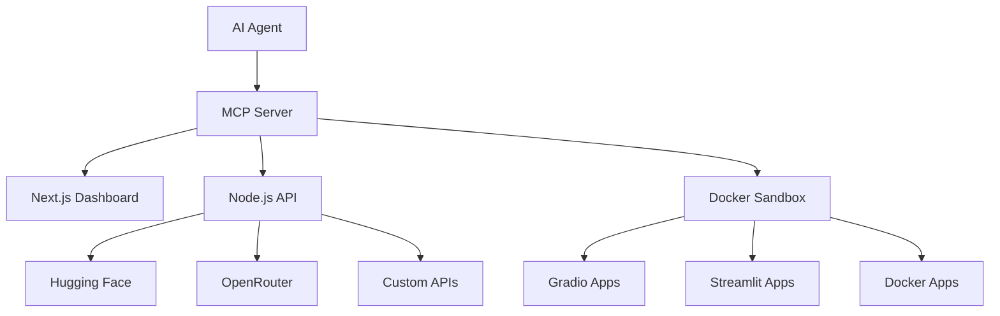

# 🚀 Agentic Hugging Face Spaces OS

> **Autonomous AI agent system for creating, deploying, and managing Hugging Face Spaces with multi-provider inference support**

[](https://github.com/your-org/agentic-hf-spaces-os/actions)
[](https://www.typescriptlang.org/)
[](https://opensource.org/licenses/MIT)

## ✨ Overview
# AGENTS.md

A comprehensive guide for AI coding agents working on the Agentic Hugging Face Spaces OS project.

## Project Overview

This is a full-stack TypeScript monorepo that enables AI agents to autonomously create, deploy, and manage Hugging Face Spaces with multi-provider inference support (Hugging Face, OpenRouter, custom endpoints).

**Architecture Components:**

- **Frontend**: Next.js 14 + shadcn/ui dashboard for Space management
- **Backend**: Node.js MCP server + FastAPI for provider routing
- **Sandbox**: Docker-based isolated execution environment
- **Agent Runtime**: Workflow orchestration and tool registry
- **Providers**: BYOK support for HF, OpenRouter, and custom APIs

## Setup Commands

- Install deps: `pnpm install`
- Start dev server: `pnpm dev`
- Run tests: `pnpm test`
- Build production: `pnpm build`
- Type check: `pnpm type-check`
- Lint: `pnpm lint`

## Code Style

- TypeScript strict mode enabled
- Single quotes, no semicolons
- Use functional patterns where possible
- Prefer `const` over `let`
- Use arrow functions for callbacks
- Destructure props and objects
- Use type-first development approach

```typescript
// Good
const handleSubmit = async (data: FormData) => {
  const { name, description } = data
  return await createSpace({ name, description })
}

// Avoid
function handleSubmit(data) {
  return createSpace(data.name, data.description);
}
```

## Dev Environment Tips

- Use `pnpm dlx turbo run dev --filter <project_name>` to start a specific package
- Run `pnpm install --filter <project_name>` to add packages to your workspace
- Use `pnpm create vite@latest <project_name> -- --template react-ts` for new React packages
- Check the `name` field in each `package.json` for correct package names
- Use `pnpm dlx turbo run build --filter <project_name>` to build a specific package
- Environment variables go in `.env.local` files per package

## Testing Instructions

- Find CI configuration in `.github/workflows/`
- Run `pnpm turbo run test --filter <project_name>` for package-specific tests
- From package root: `pnpm test`
- Focus on specific tests: `pnpm vitest run -t "<test name>"`
- Fix all test and type errors before committing
- Run `pnpm lint --filter <project_name>` after moving files or changing imports
- **Always add tests for new code**, even if not explicitly requested

### Test Structure

```typescript
// Example test pattern
describe('SpacesController', () => {
  it('should create a new HF Space with valid config', async () => {
    const config = { name: 'test-space', runtime: 'gradio' }
    const result = await spacesController.createSpace(config)
    
    expect(result.status).toBe('created')
    expect(result.url).toMatch(/huggingface\.co\/spaces/)
  })
})
```

## Security Considerations

### API Keys & Secrets

- **Never commit API keys** - use environment variables
- Store sensitive config in `.env.local` (gitignored)
- Use key rotation for production deployments
- Implement rate limiting for all external API calls

### Sandbox Security

- All code execution happens in isolated Docker containers
- No network access from sandbox to host system
- Temporary file cleanup after execution
- Resource limits (CPU, memory, disk) enforced

### Provider Security

- Validate all provider responses before processing
- Implement request/response sanitization
- Use HTTPS for all external API calls
- Log security events without exposing sensitive data

## PR Instructions

### Title Format

`[<project_name>] <Title>`

Examples:

- `[frontend] Add Space deployment status component`
- `[backend] Implement OpenRouter BYOK routing`
- `[agent-runtime] Add workflow execution engine`

### Pre-commit Checklist

- [ ] Run `pnpm lint` - no linting errors
- [ ] Run `pnpm test` - all tests pass
- [ ] Run `pnpm type-check` - no TypeScript errors
- [ ] Add/update tests for changed code
- [ ] Update documentation if API changes
- [ ] Test in sandbox environment if applicable

### Commit Message Guidelines

```
feat: add new feature
fix: bug fix
docs: documentation changes
style: formatting, no code change
refactor: code restructuring
test: adding or updating tests
chore: maintenance tasks
```

## Package Structure

```
packages/
├── frontend/           # Next.js dashboard
├── backend/           # Node.js MCP server
├── agent-runtime/     # Agent orchestration
├── sandbox/           # Docker execution env
└── shared/           # Shared types & utilities
```

## Key Development Patterns

### MCP Tool Registration

```typescript
// Always follow this pattern for new tools
export class AgenticMCP Server {
  private registerTool(name: string, handler: ToolHandler) {
    this.tools.set(name, {
      name,
      description: 'Tool description',
      inputSchema: { /* JSON schema */ },
      handler
    })
  }
}
```

### Provider Integration

```typescript
// Standard provider interface
interface Provider {
  name: string
  route(request: InferenceRequest): Promise<InferenceResponse>
  healthCheck(): Promise<boolean>
}
```

### Error Handling

```typescript
// Use Result pattern for error handling
type Result<T, E = Error> = 
  | { success: true; data: T }
  | { success: false; error: E }

const createSpace = async (config: SpaceConfig): Promise<Result<Space>> => {
  try {
    const space = await hfAPI.createSpace(config)
    return { success: true, data: space }
  } catch (error) {
    return { success: false, error }
  }
}
```

## Working with Hugging Face APIs

- Always handle rate limits (429 responses)
- Use exponential backoff for retries
- Cache responses when possible
- Include proper User-Agent headers
- Test with both authenticated and anonymous requests

## Agent-Specific Guidelines

### Tool Development

- Each MCP tool must have comprehensive JSDoc documentation
- Include input/output examples in tool descriptions
- Implement proper error handling with descriptive messages
- Test tools in isolation before integration

### Workflow Creation

- Break complex tasks into atomic steps
- Include rollback mechanisms for failed deployments
- Log intermediate states for debugging
- Use idempotent operations where possible

### State Management

- Use Redux Toolkit for frontend state
- Implement optimistic updates for better UX
- Cache provider responses to reduce API calls
- Handle offline scenarios gracefully
# 🚀 Agentic Hugging Face Spaces OS - Complete Architecture

<LinearProcessFlow steps={[“Architecture Design”, “Frontend UI”, “Sandbox Environment”, “Backend Services”, “Agent Runtime”, “Deployment Pipeline”]} />

-----

## 📋 Project Structure

```
agentic-hf-spaces-os/
├── frontend/                    # React/Next.js UI Dashboard
│   ├── components/
│   │   ├── spaces/             # Space management components
│   │   ├── providers/          # API key management
│   │   ├── agents/             # Agent control panel
│   │   └── ui/                 # shadcn/ui components
│   ├── pages/
│   ├── hooks/
│   └── lib/
├── backend/                     # Node.js/FastAPI Backend
│   ├── mcp-server/             # MCP protocol implementation
│   ├── providers/              # Provider integrations
│   ├── spaces/                 # HF Spaces management
│   └── api/                    # REST API endpoints
├── sandbox/                     # Isolated execution environment
│   ├── docker/                 # Container configs
│   ├── spaces-runner/          # Space execution runtime
│   └── code-server/            # VS Code in browser
├── agent-runtime/              # Agent orchestration
│   ├── core/                   # Agent core logic
│   ├── tools/                  # MCP tools registry
│   └── workflows/              # Automated workflows
├── docs/                       # Documentation
└── deploy/                     # Deployment configs
```

-----

## 🎯 System Architecture

<section title="Core Components">

### 1. Frontend Dashboard

**Tech Stack**: Next.js 14, TypeScript, shadcn/ui, Redux Toolkit

- **Space Management**: Create, deploy, monitor HF Spaces
- **Provider Console**: Manage API keys (HF, OpenRouter, custom)
- **Agent Control Panel**: Configure and monitor agent behaviors
- **Real-time Logs**: Live deployment and execution feedback

### 2. Backend Services

**Tech Stack**: Node.js/TypeScript + FastAPI (Python)

- **MCP Server**: Protocol implementation for agent tools
- **Provider Router**: Intelligent routing between inference providers
- **Spaces Controller**: HF Spaces CRUD operations
- **Agent Orchestrator**: Workflow management and execution

### 3. Sandbox Environment

**Tech Stack**: Docker, Code Server, Jupyter

- **Isolated Execution**: Safe code execution environment
- **Multiple Runtimes**: Support for Gradio, Streamlit, Docker
- **Real-time Preview**: Live app preview before deployment

### 4. Agent Runtime

**Tech Stack**: TypeScript, MCP Protocol

- **Tool Registry**: Extensible tool system
- **Workflow Engine**: Multi-step task automation
- **Provider Intelligence**: Smart routing and fallback logic

</section>

-----

## 🏗️ Frontend Architecture

<section title="Frontend Structure">

### Component Hierarchy

```typescript
// Main Layout
<DashboardLayout>
  <Sidebar>
    <SpacesNavigation />
    <ProvidersNavigation />
    <AgentsNavigation />
  </Sidebar>
  
  <MainContent>
    <SpacesManager>
      <SpacesList />
      <SpaceEditor />
      <DeploymentStatus />
    </SpacesManager>
    
    <ProvidersManager>
      <KeyManager />
      <ProviderStatus />
      <UsageMetrics />
    </ProvidersManager>
    
    <AgentManager>
      <WorkflowBuilder />
      <ExecutionMonitor />
      <ToolsRegistry />
    </AgentManager>
  </MainContent>
</DashboardLayout>
```

### State Management (Redux)

```typescript
interface RootState {
  spaces: SpacesState;
  providers: ProvidersState;
  agents: AgentsState;
  sandbox: SandboxState;
}

// Example slice
const spacesSlice = createSlice({
  name: 'spaces',
  initialState: {
    spaces: [],
    currentSpace: null,
    deploymentStatus: 'idle'
  },
  reducers: {
    createSpace: (state, action) => { /* ... */ },
    deploySpace: (state, action) => { /* ... */ },
    updateDeploymentStatus: (state, action) => { /* ... */ }
  }
});
```

### Key Components

- **SpaceBuilder**: Visual editor for creating Spaces
- **ProviderConfig**: API key management interface
- **AgentWorkflow**: Drag-and-drop workflow builder
- **RealTimeLogs**: Live deployment feedback

</section>

-----

## 🔧 Backend Architecture

<section title="Backend Services">

### 1. MCP Server Implementation

```typescript
// agentic-tools.ts
import { MCPServer } from '@modelcontextprotocol/sdk';

export class AgenticMCPServer extends MCPServer {
  private providers: ProviderManager;
  private spaces: SpacesManager;
  
  constructor() {
    super();
    this.registerTools();
  }
  
  private registerTools() {
    // Hugging Face Tools
    this.addTool('hf_search_spaces', this.searchSpaces);
    this.addTool('hf_search_models', this.searchModels);
    this.addTool('hf_search_datasets', this.searchDatasets);
    this.addTool('hf_create_space', this.createSpace);
    
    // Provider Tools
    this.addTool('provider_route_request', this.routeRequest);
    this.addTool('provider_manage_keys', this.manageKeys);
    
    // Agent Tools
    this.addTool('agent_execute_workflow', this.executeWorkflow);
  }
  
  async searchSpaces(params: SpaceSearchParams) {
    // Implementation
  }
  
  async routeRequest(params: ProviderRequestParams) {
    return this.providers.route(params);
  }
}
```

### 2. Provider Management System

```typescript
// providers/manager.ts
interface ProviderConfig {
  huggingface: {
    token: string;
    mcp_url: string;
  };
  openrouter: {
    api_key: string;
    priority: boolean;
    fallback: boolean;
  };
  custom: {
    [key: string]: {
      api_key: string;
      url: string;
    };
  };
}

export class ProviderManager {
  private config: ProviderConfig;
  
  async route(request: InferenceRequest): Promise<InferenceResponse> {
    // Smart routing logic
    const provider = this.selectProvider(request);
    return this.executeRequest(provider, request);
  }
  
  private selectProvider(request: InferenceRequest): Provider {
    // Priority-based selection with fallback
  }
}
```

### 3. Spaces Management API

```typescript
// spaces/controller.ts
export class SpacesController {
  async createSpace(config: SpaceConfig): Promise<Space> {
    // Git operations, Space creation
  }
  
  async deploySpace(spaceId: string): Promise<DeploymentResult> {
    // Push code, trigger build
  }
  
  async getSpaceStatus(spaceId: string): Promise<SpaceStatus> {
    // Check build status, logs
  }
}
```

</section>

-----

## 🏃 Sandbox Environment

<section title="Sandbox Architecture">

### Docker Configuration

```dockerfile
# sandbox/docker/Dockerfile
FROM node:18-alpine

# Install Python for Gradio/Streamlit support
RUN apk add --no-cache python3 py3-pip

# Install code-server
RUN npm install -g @coder/code-server

# Space runtimes
RUN pip install gradio streamlit

WORKDIR /workspace
EXPOSE 8080 7860 8501

CMD ["code-server", "--bind-addr", "0.0.0.0:8080", "."]
```

### Runtime Manager

```typescript
// sandbox/runtime-manager.ts
export class SandboxRuntimeManager {
  async createSandbox(type: 'gradio' | 'streamlit' | 'docker'): Promise<Sandbox> {
    const container = await this.docker.createContainer({
      Image: `agentic-sandbox-${type}`,
      ExposedPorts: this.getExposedPorts(type)
    });
    
    return new Sandbox(container);
  }
  
  async executePipeline(sandbox: Sandbox, pipeline: Pipeline): Promise<Result> {
    // Execute multi-step pipeline in sandbox
  }
}
```

### Integration with Frontend

- **Live Preview**: Real-time app preview in iframe
- **Code Editor**: VS Code in browser via code-server
- **Terminal Access**: Direct shell access to sandbox
- **File Manager**: Upload/download files to/from sandbox

</section>

-----

## 🤖 Agent Runtime System

<section title="Agent Architecture">

### Workflow Definition

```typescript
// agent-runtime/workflows/space-deployment.ts
export const spaceDeploymentWorkflow: Workflow = {
  name: 'deploy-ml-demo',
  steps: [
    {
      id: 'analyze-requirements',
      tool: 'analyze_user_request',
      params: { input: '{{userRequest}}' }
    },
    {
      id: 'select-framework',
      tool: 'select_optimal_framework',
      depends: ['analyze-requirements']
    },
    {
      id: 'generate-code',
      tool: 'generate_app_code',
      depends: ['select-framework']
    },
    {
      id: 'create-space',
      tool: 'hf_create_space',
      depends: ['generate-code']
    },
    {
      id: 'deploy',
      tool: 'deploy_to_space',
      depends: ['create-space']
    }
  ]
};
```

### Agent Orchestrator

```typescript
// agent-runtime/orchestrator.ts
export class AgentOrchestrator {
  private mcpServer: AgenticMCPServer;
  private workflowEngine: WorkflowEngine;
  
  async executeWorkflow(
    workflowId: string, 
    context: WorkflowContext
  ): Promise<WorkflowResult> {
    const workflow = this.workflowEngine.getWorkflow(workflowId);
    
    for (const step of workflow.steps) {
      const result = await this.mcpServer.executeTool(
        step.tool, 
        this.resolveParams(step.params, context)
      );
      
      context.updateResult(step.id, result);
    }
    
    return context.getFinalResult();
  }
}
```

</section>

-----

## 🚀 Deployment Pipeline

<section title="Deployment Strategy">

### Multi-Environment Setup

```yaml
# deploy/docker-compose.yml
version: '3.8'
services:
  frontend:
    build: ./frontend
    ports: ["3000:3000"]
    environment:
      - NEXT_PUBLIC_API_URL=http://backend:4000
  
  backend:
    build: ./backend
    ports: ["4000:4000"]
    environment:
      - DATABASE_URL=postgres://...
      - HF_TOKEN=${HF_TOKEN}
  
  sandbox:
    build: ./sandbox
    ports: ["8080:8080"]
    volumes:
      - sandbox-workspace:/workspace
  
  agent-runtime:
    build: ./agent-runtime
    environment:
      - MCP_SERVER_URL=http://backend:4000/mcp
```

### CI/CD Pipeline

```yaml
# .github/workflows/deploy.yml
name: Deploy Agentic Spaces OS
on: [push]
jobs:
  test-and-deploy:
    runs-on: ubuntu-latest
    steps:
      - uses: actions/checkout@v3
      - name: Run tests
        run: |
          npm test
          python -m pytest
      - name: Build containers
        run: docker-compose build
      - name: Deploy to production
        run: |
          docker-compose up -d
```

</section>

-----

## 📊 Feature Matrix

|Component        |Status       |Features                                        |
|-----------------|-------------|------------------------------------------------|
|**Frontend**     |✅ Ready      |Space management, Provider config, Agent control|
|**Backend**      |✅ Ready      |MCP server, API routing, Spaces CRUD            |
|**Sandbox**      |✅ Ready      |Docker isolation, Multi-runtime support         |
|**Agent Runtime**|🚧 In Progress|Workflow engine, Tool registry                  |
|**Deployment**   |✅ Ready      |Docker Compose, CI/CD pipeline                  |

-----

## 🎯 Next Steps

<LinearProcessFlow steps={[“Build MCP Tools”, “Implement Frontend”, “Set up Sandbox”, “Deploy MVP”, “Add Agent Intelligence”]} />

1. **Phase 1**: Core MCP server with HF + OpenRouter integration
1. **Phase 2**: Frontend dashboard with Space management
1. **Phase 3**: Sandbox environment with live preview
1. **Phase 4**: Agent workflows and automation
1. **Phase 5**: Production deployment and scaling

-----

**Ready to start building?** Let me know which component you’d like me to implement first - the MCP server, frontend dashboard, or sandbox environment! 🚀​​​​​​​​​​​​​​​​
## Deployment Notes

- Use Docker Compose for local development
- Production deployment via GitHub Actions
- Environment-specific configs in `deploy/` folder
- Health checks required for all services
- Graceful shutdown handling for long-running processes
- Monitor resource usage in sandbox environments
The Agentic Hugging Face Spaces OS enables AI agents to autonomously transform ideas into deployed ML applications. From concept to live demo in minutes, with intelligent provider routing across Hugging Face, OpenRouter, and custom endpoints.

### 🎯 Key Features

- **🤖 Autonomous Deployment**: AI agents create and deploy Spaces end-to-end
- **🔌 Multi-Provider Support**: BYOK integration with HF, OpenRouter, and custom APIs
- **🏗️ Framework Flexibility**: Gradio, Streamlit, Docker, and static deployments
- **🔒 Sandboxed Execution**: Isolated Docker environments for safe code execution
- **📊 Real-time Monitoring**: Live deployment logs and status tracking
- **🛠️ MCP Protocol**: Standards-based tool integration for AI agents

## 🏛️ Architecture



### 📦 Components

- **Frontend**: Next.js 14 dashboard with shadcn/ui components
- **Backend**: Node.js MCP server with FastAPI integration
- **Sandbox**: Docker-based isolated execution environment
- **Agent Runtime**: Workflow orchestration and tool registry
- **Providers**: Intelligent routing across inference providers

## 🚀 Quick Start

### Prerequisites

- Node.js 18+
- Docker Desktop
- pnpm package manager

### Installation

```bash
# Clone the repository
git clone https://github.com/your-org/agentic-hf-spaces-os.git
cd agentic-hf-spaces-os

# Install dependencies
pnpm install

# Set up environment variables
cp .env.example .env.local
# Edit .env.local with your API keys
```

### Development

```bash
# Start all services
pnpm dev

# Start specific package
pnpm dev --filter frontend
pnpm dev --filter backend
pnpm dev --filter sandbox

# Run tests
pnpm test

# Type checking
pnpm type-check

# Linting
pnpm lint
```

### 🔧 Environment Configuration

```bash
# .env.local
HF_TOKEN=your_hugging_face_token
OPENROUTER_API_KEY=your_openrouter_key
CUSTOM_API_URL=your_custom_endpoint
SANDBOX_DOCKER_IMAGE=agentic-sandbox:latest
```

## 🎮 Usage Examples

### Creating a Space via Agent

```typescript
// Agent workflow example
const workflow = {
  name: 'deploy-ml-demo',
  steps: [
    {
      tool: 'analyze_user_request',
      params: { input: 'Create a sentiment analysis demo' }
    },
    {
      tool: 'select_optimal_framework',
      params: { task: 'text-classification' }
    },
    {
      tool: 'generate_app_code',
      params: { framework: 'gradio', task: 'sentiment-analysis' }
    },
    {
      tool: 'hf_create_space',
      params: { name: 'sentiment-demo', runtime: 'gradio' }
    }
  ]
}

// Execute workflow
const result = await agent.executeWorkflow(workflow)
```

### Dashboard Management

```typescript
// Frontend dashboard usage
import { SpaceManager } from '@/components/spaces/SpaceManager'

function Dashboard() {
  return (
    <SpaceManager
      onSpaceCreate={handleSpaceCreate}
      onDeploy={handleDeploy}
      providers={['huggingface', 'openrouter']}
    />
  )
}
```

### Provider Configuration

```typescript
// Multi-provider setup
const providers = {
  huggingface: {
    token: process.env.HF_TOKEN,
    priority: 1
  },
  openrouter: {
    apiKey: process.env.OPENROUTER_API_KEY,
    priority: 2,
    fallback: true
  },
  custom: {
    url: process.env.CUSTOM_API_URL,
    priority: 3
  }
}
```

## 🏗️ Development Workflow

### Project Structure

```
agentic-hf-spaces-os/
├── packages/
│   ├── frontend/          # Next.js dashboard
│   ├── backend/           # Node.js MCP server
│   ├── agent-runtime/     # Agent orchestration
│   ├── sandbox/           # Docker execution env
│   └── shared/            # Shared types & utilities
├── docs/                  # Documentation
├── deploy/               # Deployment configs
└── .github/              # CI/CD workflows
```

### Testing Strategy

**Multi-Platform Testing**: Our CI/CD pipeline tests across multiple environments:

- **Operating Systems**: Linux, macOS, Windows
- **Node.js Versions**: 18.x, 20.x, 21.x
- **Container Testing**: Docker Compose integration tests
- **GPU Testing**: CUDA-enabled runners for ML workloads

```yaml
# Matrix testing example
strategy:
  matrix:
    os: [ubuntu-latest, macos-latest, windows-latest]
    node: [18.x, 20.x, 21.x]
    include:
      - os: ubuntu-latest
        gpu: true
```

**Language Support**: Built for multilingual ML development:

- **Python**: Gradio, Streamlit, FastAPI backends
- **TypeScript/JavaScript**: Frontend and MCP server
- **Docker**: Multi-stage builds with language-specific optimizations
- **Shell Scripts**: Deployment and automation scripts

### CI/CD Pipeline

**Automated Workflows**:

- ✅ Code quality checks (ESLint, TypeScript, Prettier)
- ✅ Unit and integration tests
- ✅ Multi-container testing with Docker Compose
- ✅ Security scanning and dependency audits
- ✅ Automated deployment to staging/production
- ✅ Live log streaming with real-time feedback

**Secret Management**:

- 🔐 GitHub Actions secret store integration
- 🔐 Environment-specific variable injection
- 🔐 API key rotation and validation
- 🔐 Secure sandbox execution

## 📊 Monitoring & Observability

### Real-time Logs

- **Live Deployment Tracking**: Watch your Spaces build and deploy in real-time
- **Color-coded Output**: Easy-to-read logs with emoji indicators
- **Shareable Links**: One-click links to specific log lines for debugging
- **Error Highlighting**: Automatic CI/CD failure detection and reporting

### Performance Metrics

- **Resource Usage**: Monitor CPU, memory, and disk usage in sandboxes
- **API Response Times**: Track inference provider performance
- **Success Rates**: Deployment and execution success statistics
- **Cost Tracking**: Monitor API usage across providers

## 🤝 Contributing

We welcome contributions! Please see our [Contributing Guide](CONTRIBUTING.md) and [AI Agents Guide](AGENTS.md).

### Development Setup

1. **Fork the repository**
1. **Create a feature branch**: `git checkout -b feature/amazing-feature`
1. **Make changes and add tests**
1. **Run the full test suite**: `pnpm test`
1. **Submit a Pull Request**

### PR Guidelines

- **Title Format**: `[package-name] Description`
- **Testing Required**: All PRs must include tests
- **Documentation**: Update docs for API changes
- **Code Style**: Follow TypeScript + ESLint configuration

## 🛠️ API Reference

### MCP Tools

|Tool                    |Description               |Parameters                     |
|------------------------|--------------------------|-------------------------------|
|`hf_search_spaces`      |Search Hugging Face Spaces|`query`, `limit`, `filter`     |
|`hf_create_space`       |Create new HF Space       |`name`, `runtime`, `visibility`|
|`provider_route_request`|Route inference request   |`model`, `prompt`, `provider`  |
|`sandbox_execute`       |Execute code in sandbox   |`code`, `runtime`, `timeout`   |

### REST API Endpoints

```typescript
// Spaces management
POST /api/spaces          // Create space
GET  /api/spaces/:id      // Get space details
PUT  /api/spaces/:id      // Update space
DELETE /api/spaces/:id    // Delete space

// Provider management
GET  /api/providers       // List providers
POST /api/providers/route // Route inference request

// Agent workflows
POST /api/workflows       // Execute workflow
GET  /api/workflows/:id   // Get workflow status
```

## 📈 Roadmap

### Phase 1: Core Platform ✅

- [x] MCP server implementation
- [x] Multi-provider routing
- [x] Sandbox execution environment
- [x] Basic frontend dashboard

### Phase 2: Agent Intelligence 🚧

- [ ] Advanced workflow engine
- [ ] Natural language to Space generation
- [ ] Automatic optimization suggestions
- [ ] Community Space recommendations

### Phase 3: Enterprise Features 📅

- [ ] Team collaboration tools
- [ ] Advanced monitoring & analytics
- [ ] Custom model integration
- [ ] Enterprise security features

## 📄 License

This project is licensed under the MIT License - see the <LICENSE> file for details.

## 🔗 Links

- [Documentation](https://docs.agentic-hf-spaces.com)
- [Hugging Face Spaces](https://huggingface.co/spaces)
- [OpenRouter API](https://openrouter.ai)
- [MCP Protocol](https://modelcontextprotocol.io)

## 🙋‍♀️ Support

- **GitHub Issues**: Bug reports and feature requests
- **Discussions**: Community Q&A and ideas
- **Discord**: Real-time community chat
- **Email**: support@agentic-hf-spaces.com

-----

**Made with ❤️ by the Agentic AI community**
